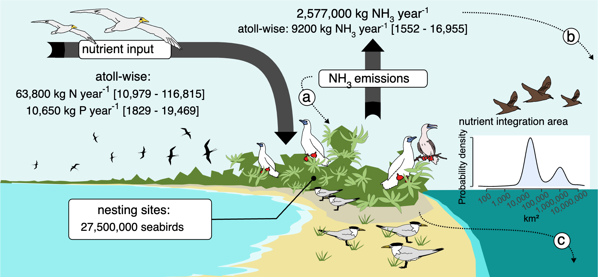

# Atoll seabird analysis



Short summary of main findings goes here.

## Cite

**TODO**: Replace XXXX with a bibtex shorthand for the paper and journal.

```bibtex
@article{steibl2024XXXX,
  title={Atolls are globally significant hubs for tropical seabirds},
  author={Steibl, Sebastian and Steiger, Simon and Wegmann and Alex S and Holmes, Nick D and Young, Hillary S and Carr, Pete and Russell, James C},
  journal={XXXX},
  year={2024}
}
```

## Workflow

This would be nice, but we did not go with a figure for this.
Drop or describe in text format?

## Installation

### System-independent prerequisites

1. Install the R programming language ([Windows](https://cran.r-project.org/bin/windows/), [MacOS](https://cran.r-project.org/bin/macosx/), [Linux](https://cran.r-project.org/bin/linux/))
2. Install the [Julia programming language](https://julialang.org/downloads/). Check the option to *Add julia to the PATH* to skip step 3.
3. Add R and Julia to the PATH (Instructions for [Julia](https://julialang.org/downloads/platform/), the process is the same for R except that you will have to add the directory of the R binary). You can test if you previously added R or Julia to the PATH by running `R` or `julia` in a Unix shell. **Tip**: If you do not know the path to your Julia binary, you can write `Sys.BINDIR` in the Julia REPL. For the equivalent in R, run `R.home("bin")` in an R console.

### Windows-specific prerequisites

Install an environment that allows you to run bash scripts, like [Git Bash](https://gitforwindows.org/)

### Unix-based systems

Unix-based systems support executing bash scripts natively.
However, since the default shell used by MacOS is now the Z shell, we recommend running the commands under [Reproducing results](#reproducing-results) in the bash shell.

## Reproducing results

You can reproduce the analysis and corresponding visualisations by executing the `reproduce.sh` script.
To do so, start by making this file executable on your machine:

```console
$ chmod +x /path/to/repository/reproduce.sh
```

Replace the segment `/path/to/repository` below with the path to the project folder on your machine.

Next, run all scripts by executing `reproduce.sh`:

```console
$ ./reproduce.sh /path/to/repository true true false
```

Replace the segment `path/to/repository` with the path to the project folder on your machine.

**Note on Z shell:**
To run the above command in Z shell, prefix with `bash`, i.e., `% bash ./reproduce.sh ...`.

**Additional arguments:**
The extra arguments to `reproduce.sh` (`true true false`) are forwarded to the Julia scripts, and intend to give the user more fine-grained control over the runtime.
The first argument determines if the analysis scripts sample from the posterior (`true`) or attempt to load previously saved chains (`false`). Loading saved chains requires having sampled from the posterior at least once on your machine.
The second argument determines if [cross validation](https://mc-stan.org/loo/articles/online-only/faq.html) is performed (`true`) or skipped (`false`).
The third argument determines if sensitivity analyses with different prior settings are run (`true`), or if only the default prior is used (`false`).
Note that running sensitivity analyses quadruples the runtime.

**Run-time:**
The analyses were performed on a MacBook Pro (M1) and took 90 minutes, including 10 minutes of package download and precompilation.
These values depend on the speed of your computer and internet connection.

## Project structure

A sentence or two about the project structure.

```
├── R                            # R scripts
│   ├── wrangle                      # Data wrangling of remotesensing data
│   └── create_figures.R             # Creates raw figures for article
├── data                         # CSV files which are *inputs to* the model
├── figures                      # Final figures used in the article
├── julia                        # Julia scripts
│   ├── scripts                      # Analysis scripts
│   ├── src                          # Modules defining functions and variables
│   └── reproduce.jl                 # Runs all julia scripts
├── manuscript                   # Directory with manuscript
├── renv                         # Renv for storing R package versions
├── results                      # Outputs of modeling
│   ├── chains                       # Chains will be saved here
│   ├── data                         # CSV files which are *outputs of* the model
│   ├── png                          # PNG files
│   └── svg                          # SVG files
.
.
.
└── reproduce.sh                 # Execute entire model pipeline, see "Installation" above for instructions
```

## Note on remotesensing data

The raw data downloaded from [Copernicus](https://marine.copernicus.eu/access-data/ocean-monitoring-indicators) and [JISAO](https://www.pmel.noaa.gov/co2/story/JISAO) are too large to share on GitHub.
We are only uploading the specifications we used to download them and the scripts we used to clean them.
The scripts can be found in the `R/wrangle` directory.
