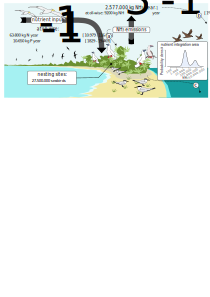

# Atoll seabird analysis

Text about main findings 

(figure seems to have a lot of whitespace below it)



## Workflow

This would be nice, but we did not go with a figure for this.
Drop or describe in text format?

## Installation

Make sure to run this in an environment that supports bash if you are on Windows, e.g., Git Bash.

```bash
chmod +x /path/to/repository/reproduce.sh # Make shell script executable
bash ./reproduce.sh /path/to/repository true true # Reproduce all scripts
```

### Note on ARGS 

- first arg is the path
- second arg is sampling from posterior (! requires locally saved chains)
- third arg is running LOO CV

## Project structure

TODO: Move R wrangle scripts into R/wrangle folder

```
├── R                            # R scripts
│   ├── wrangle                      # R scripts used for data wrangling
│   └── create_figures.R             # Creates raw figures for article
├── data                         # CSV files which are *inputs to* the model
├── figures                      # Final figures used in the article
├── julia                        # Julia scripts
│   ├── scripts                      # Julia scripts used for data wrangling
│   ├── scripts                      # Julia scripts used for data wrangling
│   └── reproduce.jl                 # Runs all julia scripts
├── manuscript                   # Directory with manuscript
├── renv                         # Renv for storing R package versions
├── results                      # Outputs of modeling
│   ├── chains                       # Chains will be saved here
│   ├── data                         # CSV files which are *outputs of* the model
│   ├── png                          # PNG files
│   └── svg                          # SVG files
.
.
.
└── reproduce.sh                 # Execute entire model pipeline, see "Installation" above for instructions
```
